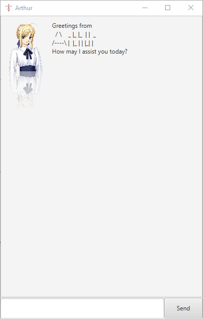

# User Guide
This is the User Guide for Arthur your personal task
manager. 

## Quick Start
1. Ensure that Java `11` or above is installed 
your computer.
2. Download the latest `arthur.jar` from 
[here](https://github.com/Vishwanth2210/ip/releases).
3. Copy the file to a folder you want to use as the
home folder for Arthur.
4. Double-click on the file to start the app. The app would be similar to the image below upon startup.

As you run commands, the app would look similar to the image below.

## Features 
- Listing all tasks: `list`
- Exiting Arthur: `bye`
- Deleting a specific task: `delete`
- Finding a specific task: `find`
- Marking a task as completed: `mark` 
- Un-marking a task as incomplete: `unmark` 
- Showing tasks due today: `reminder`
- Adding new todo task: `todo`
- Adding new deadline task: `deadline`
- Adding new event task: `event`

## Usage

### `list`
Shows a list of all the tasks in Arthur.

Example of **usage**:
`list`

### `bye`
Closes and exits the application Arthur.

Example of **usage**:
`bye`

Expected outcome:
Arthur displays a bye message and automatically 
closes the application.

### `delete`

Deletes the task determined by the number from
the list.

Example of usage:
`delete 2`

Expected outcome:
Deletes the task number 2 from the list.

### `find`

Finds and lists all the tasks from the list that 
matches the provided keyword (case-insensitive)

Example of usage:
`find code`

Expected outcome:
Finds and lists all the tasks that have the keyword
"code" in its description.

### `mark`

Marks the task specified by the number and places
a tick on the left.

Example of usage:
`mark 4`

Expected outcome:
Marks the task number 4 and places a tick.

### `unmark`

Unmark the task specified by the number and 
removes any tick placed on the left.

Example of usage:
`unmark 1`

Expected outcome:
Unmarks and removes the tick (if any) from task
number 1.

### `reminder`

Lists all the tasks that are due/occurring on 
the current day.

Example of usage:
`reminder`

### `todo` 

Creates a new todo task that has no date or time
limit. Details after the `todo` keyword is the 
task description.

Example of usage:
`todo Buy apples`

Expected outcome:
Adds a new todo task to the list with description
"Buy Apples".

### `deadline`

Creates a new deadline task with date and/or time 
tracking for reminder feature. Date and/or time 
entered after **/by** keyword.

* Date Format: yyyy-mm-dd (Year-month-day, in numbers)
* Time Format: hh:mm (hours:minutes, 24-hour clock) 

Example of usage:
`deadline Do Test /by 2022-02-17`

Expected outcome:
Creates new deadline task with description "Do Test"
to be completed by 17 Feb 2022.

### `event`

Creates a new event task with date and/or time tracking
for reminder feature. Date and/or time entered after 
**/at** keyword.

* Date Format: yyyy-mm-dd (Year-month-day, in numbers)
* Time Format: hh:mm (hours:minutes, 24-hour clock)

Example of usage:
`event Sunrise /at 2022-02-18 06:00`

Expected outcome:
Creates a new event task that has "Sunrise" as 
description and occurs on 18 Feb 2020 at 6:00am.
